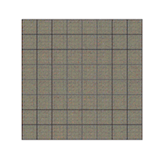
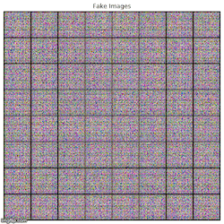
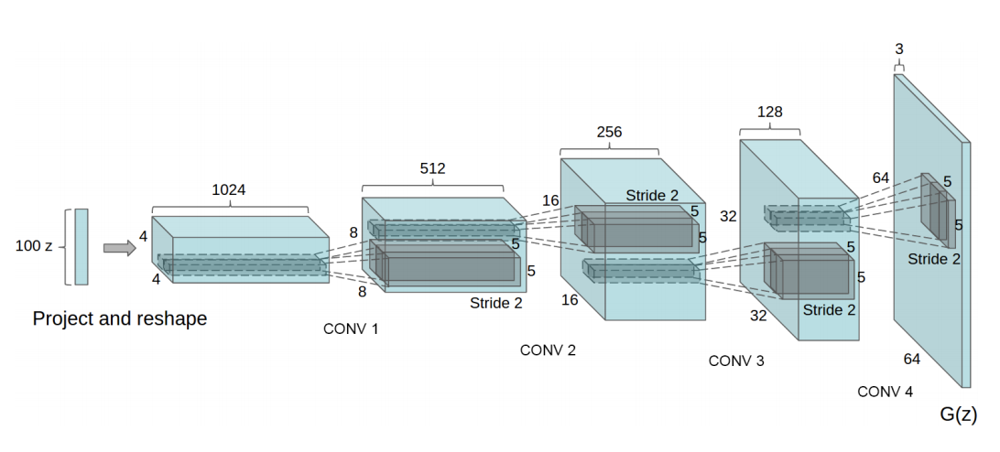
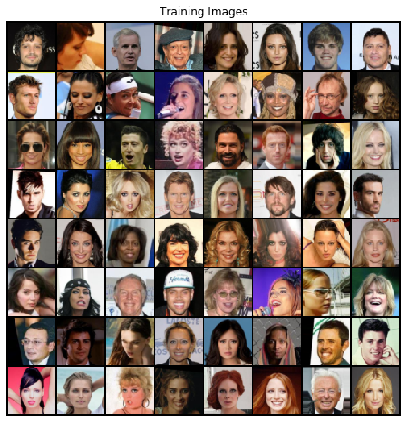
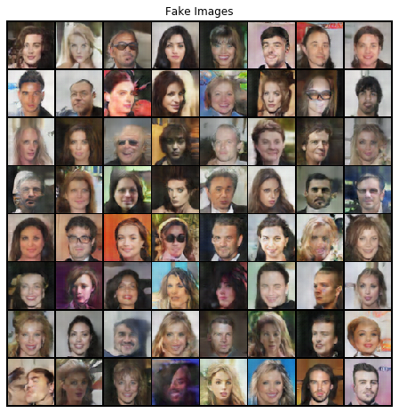
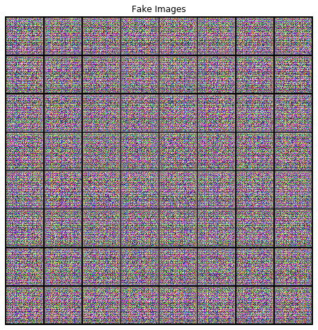
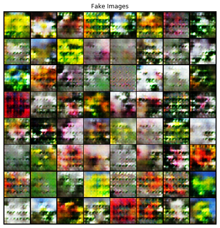
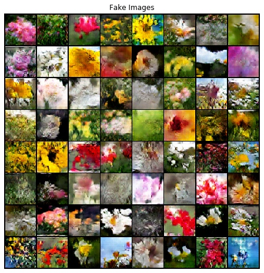

# Image-Generator
Pytorch implementation of DCGAN described in the ["Unsupervised Rrepesentation Learning with Deep Convolutional Generative Adversarial Networks"](https://arxiv.org/pdf/1511.06434.pdf)  paper by Radford et. al. to generate fake images of any given image dataset.

- Train on your custom dataset in Google Colab, checkout this [notebook](colab_demo.ipynb)

- Easily train on any image datasets and generate new images, checkout [Getting Started](#how-to-use).

- Some pertained models are available for test, checkout How to Use Pretrained Models for [Training](#training-with-pretrained-models-or-resuming-training) & [Image Generation](#generate-images)

- Learn More About [GAN](#what-is-gan) and [DCGAN](#what-is-dcgan)
- Check Out performance of the default architecture [here](#demo)




# How to Use
## Train From Scratch
Use From Terminal

```
$ python train.py --dataroot PATH_TO_DATASET --num_epochs 25
```

Access as Module in Python

```
>>> from DCGAN import train
>>> img_list, G_losses, D_losses = train(dataroot='PATH_TO_DATASET', num_epochs=25)
```
### Training Parameters

``` 
- dataroot Required; Path of source image dataset
- netD=None;  Path to pretrained/checkpoint of discriminator network file. If not provided training will start from scratch.
- netG=None; Path to pretrained/checkpoint of generator network file. If not provided, training will start from scratch.
- workers=2; Number of workers for dataloading
- batch_size=128; Batch Size for GAN training
- image_size=64; Height-width of the generated image
- nc=3; Number of channels in output image
- nz=100; Size of latent vector z; output of generator
- ngf=64; Size of feature maps in generator
- ndf=64; Size of features maps in discriminator
- num_epochs=5; Number of Epochs for training
- lr=0.0002; Learning Rate
- beta1=0.5; Beta 1 value for Adam Optimizer
- ngpu=1; Number of GPUs to use
- save_every=5; Make a checkpoint after each save_every epoch
- outputD='checkpoints/netD.pth'; Path where discriminator model will be saved/checkpoint
- outputG='checkpoints/netG.pth'; Path where generator model will be saved/checkpoint
```
### Training with Pretrained Models or Resuming Training
Simply provide netG & netD (Path to pretrained/checkpoint of network file) values for training and it'll start training from there. 

By default, checkpoints are made in checkpoints/netG.pth & checkpoints/netD.pth

```
$ python train.py --dataroot PATH_TO_DATASET --netG PATH_TO_PRETRAINED_G_MODEL --netD PATH_TO_PRETRAINED_D_MODEL 
```

```
>>> from DCGAN import train
>>> train(dataroot='PATH_TO_DATASET', netG='PATH_TO_PRETRAINED_G_MODEL', netD='PATH_TO_PRETRAINED_D_MODEL') 
```

## Generate Images
***Pretrained Models for Celeba & Flower datasets are available in the pretrained_models directory.***

Use From Terminal

```
$ python generate.py --netG PATH_TO_GENERATOR_MODEL --n 64
```

Access as Module in Python

```
>>> from DCGAN import generate
>>> generate(netG= 'PATH_TO_GENERATOR_MODEL', n=64)
```
### Parameters

``` 
- netG Required; Path to pretrained/checkpoint of generator network file which will be used to generate images.
- n=64; Number of Images to be generated
- nc=3; Number of channels in output image
- nz=100; Size of latent vector z; output of generator
- ngf=64; Size of feature maps in generator
- ngpu=1; Number of GPUs to use
- output_path='output/fake.png'; Path where generated images will be saved
```

# What is GAN
Generative Adversial Networks are Neural Nets that can generate data from scratch. In general, GAN comprises of one discriminator and one generator network. Generator networks generates new data points and discriminator checks if the generated data point is fake or real. So essentially both networks work as adverseries to beat each other: Generator attempts to fool Discriminator, Discriminator attempts to catch Generator. An ideal stop condition in training these nets would be when discriminator outputs 0.50 probability of being real for any given real or generated fake images.  

# What is DCGAN?


[Image Taken from the referenced paper by Radford et. al]

Deep Convolutional Generative Adversial Network (DCGAN) is a type of Generative Adversial Network (GAN) that explicitly uses Convolutional and Convolution Transpose layers in discriminator and generator networks respectively. Above is the architecture of the default DGCAN model implemented in this project. 

# Demo
#### Demo: [Celeba Dataset]()
Training Images



Fake Images (After 70 Epochs)



#### Demo: [Flower Dataset]()
Training Images


Fake Images (After 0 Epochs)



Fake Images (After 20 Epochs)



Fake Images (After 30 Epochs)


Fake Images (After 40 Epochs)




# References
- Unsupervised Rrepesentation Learning with Deep Convolutional Generative Adversarial Networks"(https://arxiv.org/pdf/1511.06434.pdf) by Radford et. al.